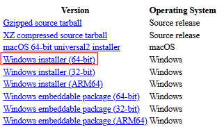
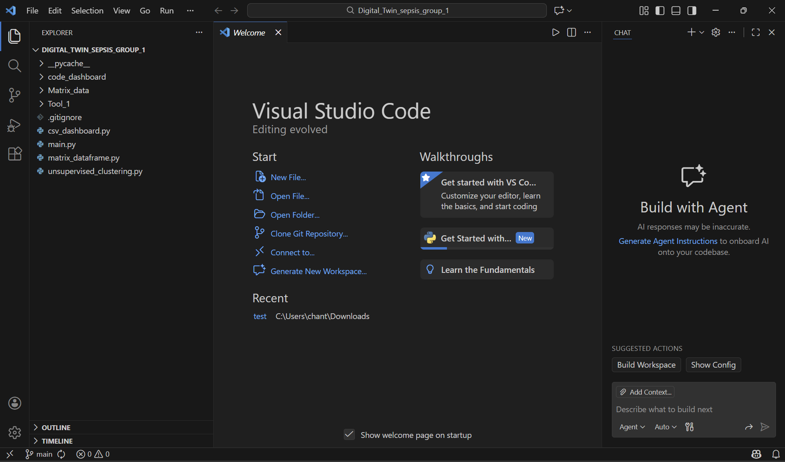
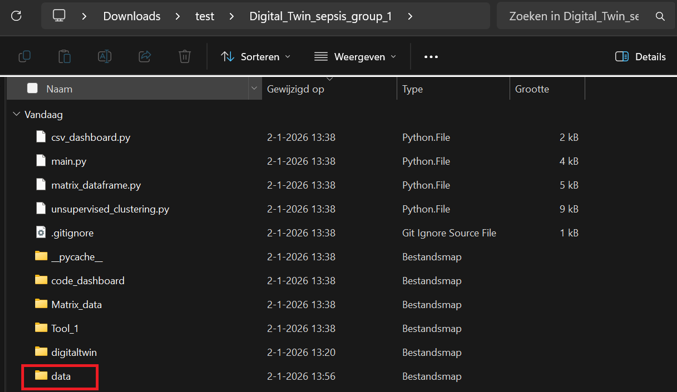

# Digital Twin Sepsis Project

## Introduction
This project focuses on analyzing sepsis patients who develop acute kidney injury (AKI), with the ultimate goal of supporting early detection and improving patient outcomes. Using data from the MIMIC-IV database provided by our technical expert, our predictive tool and model aim to help identify high-risk patients and provide insights that could reduce the likelihood of severe sepsis progression or mortality.

The first tool identifies sepsis patients and classifies their AKI stage based on serum creatinine levels, following the Kidney Disease: Improving Global Outcomes (KDIGO) guidelines. The second tool clusters patients according to key clinical and laboratory factors that may influence the severity of AKI, using a combination of Hierarchical Density-Based Spatial clustering (HDBSCAN) and Gaussian Mixture Model (GMM) clustering.
By identifying patient subgroups and their associated risk factors, this project aims to enhance understanding of the mechanisms driving AKI in sepsis and to provide clinicians with actionable insights for early intervention and risk stratification. While the clustering model itself builds on existing approaches, our work integrates these methods into an accessible tool designed to support data-driven clinical decision-making and improve patient care.


## How to Run the Code

### 1. Download and install Python
> **Note:** If you already have Python 3.12.10 installed on your system, you can skip this step.

1. Go to the following website and install python version 3.12.10: [Python 3.12.10](https://www.python.org/downloads/release/python-31210/).  
2. Scroll down to **Files**.  
3. For Windows users, download the **Windows installer (64-bit)**. 



4. After the download is finished, double-click on the installer or go to downloads
5. In the installation window:
   - Check **Add python.exe to Path**  
   - Check **Use admin privileges when installing python.exe**  
   - Click **Install Now** 
6. Wait until it says **Setup was successful**, then click **Close**.

### 2. Create a Project Folder
1. Open File Explorer  
2. Create a folder for your project and data

### 3. Install Git
> **Note:** If you already have installed Git you can skip this step.

1. Go to [Git - Install](https://git-scm.com/install/windows) and click on windows if you work with windows. Than click on ‘Click here to download' the latest (2.52.0) x64 version of Git for Windows. 
2. Run the installer and follow the steps:
   - Give permission that git can make changes on your device
   - Select default options for most prompts
   - By adjusting the name of the initial branch in new repositories choose **"Override the default branch name for new repositories"**  
   - Make sure **"Git from the command line and also from 3rd-party software"** is selected.
   - Select default options for the other prompts
   - Click on Install
   - By completing the Git Setup Wizard check launch Git Bash and not view release notes. After this you can close the Git Bash.

### 4. Download and install Visual Studio Code (VS Code)
> **Note:** If you already have installed VS code you can skip this step.

1. Go to the website: [VS Code download](https://code.visualstudio.com/download)  
2.	Click on Download for Windows if you have a windows computer
3.	After downloading, double-click the installer
4.	Follow the installation steps:
    - Accept the license agreement -> next
    - Select Destination Location -> you can click on next or change it
    - For the other messages click on next
    - By select additional tasks you can check create a desktop icon (optional)
    - Click Install
5.	When installation is finished:
    - Check launch Visual Studio Code
    - Click Finish -> VS code will be immediately launched

### 5. Install VS Code Extensions
1. In VS Code, go to **Extensions** (left sidebar), the symbol with the four cubes and click on it
2.	Search for python and click on it and click on Install
3.	If prompted to “Open a Python project folder”, select your project folder
4.	If you get the question: “Do you trust the authors of the files in this folder? Click the Trust the authors of all files in the parent folder “… (the folder you created in step 2)” And than click on “Yes, Trust the authors”
5.	After this go back to the extensions
6.	Also install Code Runner, this adds the ▷ run button

### 6. Create and activate a virtual environment
1. Open VS code. If you have already VS code installed go to File -> New window. Make sure you are in your project folder. By going to file -> open folder, select the folder you created by step 2, you can check it if you see the file name on the left side. When this is not the case click on the symbol above the search glass. If they ask do you want to save your workspace configuration as a file click on do not save
2.	In VS Code, click Terminal in the top menu
3.	If you do not see it, click the tree dots … -> Terminal -> New Terminal
4.	This opens a PowerShell terminal inside VS Code
5.	First check if the installation of python went well by typing in the terminal 
```powershell
python --version
```
6. When it says python not found click open the command palette (press Ctrl + Shift + P on Windows)
7.	Type: “Python: Select Interpreter”
8.	Choose the correct Python interpreter from the list that appears, Python 3.12.10
9.	Close the VS Code window and restart the program.
10.	Than type again python --version, and when it went good you will know see Python 3.12.10
11.	Create a virtual environment by typing the following in the powershell and click on enter
```powershell
python -m venv digitaltwin
```
12. Activate the environment by typing the following in the powershell and click on enter
```powershell
.\digitaltwin\Scripts\Activate
```
13. When activating the virtual environment does not work:
    - Type in the terminal: 
    ```powershell
    Get-ExecutionPolicy
    ```
    - If it returns Restricted, run: 
    ```powershell
    Set-ExecutionPolicy RemoteSigned -Scope CurrentUser
    ```
    - Confirm when asked. This allows virtual environments to activate correctly.
    - Than try to activate again 
	```powershell
    .\digitaltwin\Scripts\Activate
    ```
14. If activation is successful, you will see:
```powershell
(digitaltwin) PS C:\...
```
15. Type or copy the following two commands inside the activated environment in the powershel, one at a time to make sure each step completes successfully. The last one may take some time
```powershell
python -m pip install --upgrade pip
```
```powershell
pip install pandas numpy matplotlib seaborn hdbscan scikit-learn scipy statsmodels scikit_posthocs
```
16.	Type: **pip list** in the terminal, to check if all packages are installed in the environment. If some packages are missing, install them again, run **pip install ...** again in the terminal.
17.	Now check if the git is installed correctly in your environment by typing **git --version** in the terminal.
18.	If you are not yet in your environment type in the terminal:  
```powershell
.\digitaltwin\Scripts\Activate
```
19.	When activating the virtual environment does not work:
    - Type in the terminal: 
    ```powershell
    Get-ExecutionPolicy
    ```
    - If it returns Restricted, run: 
    ```powershell
    Set-ExecutionPolicy RemoteSigned -Scope CurrentUser
    ```
    - Confirm when asked. This allows virtual environments to activate correctly.
    - Than try to activate again 
	```powershell
    .\digitaltwin\Scripts\Activate
    ```
20. Than type again **git --version**. Now you should see **git version …** 

## 7. Clone the GitHub repository
1. In VS Code, press `Ctrl + Shift + P`, type in the command prompt **Git: Clone**, and click on it. Then paste the following URL:  https://github.com/LisadHooghe05/Digital_Twin_sepsis_group_1.git
2. Than you need to select a **Repository Destination** go to the folder you made in step 2 and choose this as repository destination.
3.	Than you get the question would you like to open the repository in current workspace click on **“Open”**
4.	To verify that it worked correctly, you should see the folder named **DIGITAL_TWIN_SEPSIS_GROUP_1** in the Explorer. If so, you have downloaded the correct code from GitHub.



5. If you accidentally close VS code than you can do the next steps to go back to the code
    1.	Go to file in VS code -> open folder
    2.	Select the folder digital_twin_sepsis_group_1
    3.	Click open

## 8. Activate the environment in the project folder
1. Copy the folder **digitaltwin** to the map Digital_Twin_sepsis_group_1, because only than you can use the environment and than activate it. Now close your current VS code and restart it
2.	Look if you are already in the correct folder Digital_Twin_sepsis_group_1, you can see it in the left corner if the name is there. When not click on file -> Open folder … and select this folder.
3.	Open a new Terminal: In VS Code, click Terminal in the top menu
4.	If you do not see it, click the tree dots … -> Terminal -> New Terminal
5.	You will probably see, **PS C:\Users\YourName\Path\To\Your\Project**
6.	This means that you are not yet in the environment digitaltwin so activate the environment by typing:
```powershell
.\digitaltwin\Scripts\Activate
```
7. When activating the virtual environment does not work:
    - Type in the terminal: 
    ```powershell
    Get-ExecutionPolicy
    ```
    - If it returns Restricted, run: 
    ```powershell
    Set-ExecutionPolicy RemoteSigned -Scope CurrentUser
    ```
    - Confirm when asked. This allows virtual environments to activate correctly.
    - Than try to activate again 
	```powershell
    .\digitaltwin\Scripts\Activate
    ```
    - When the environment is activated you will see **(digitaltwin) PS C:\\ ....**

## 9. Add the data files
1. Unzip the 'data' folder that was send via SURFfilesender and extract all CSV files
2.	Make a new folder in the folder Digital_Twin_sepsis_group_1 named data 



3.	Copy paste all the csv files to the new made data folder

## 10. Run the code
1.	In the terminal of VS code make sure that the environment digitaltwin is active, then run:
```powershell
python main.py
 ```
2.	If everything is set up correctly, the code should now run successfully. The code will take some time to run, when the **(digitaltwin) PS C:\ ....** is shown again, this means that the code is finished. 

## How the code works
When the main.py script is executed, it generates several output files. One of these is AKI_stage_output, which is derived from the creatinine and sepsis data of the patients. This file contains each patient’s baseline values, which are necessary to determine whether a patient develops Acute Kidney Injury (AKI). It also records the time at which a patient’s value exceeds the baseline, providing the AKI_time, which indicates when AKI is diagnosed. Using this information, all sepsis patients can be classified into those with and without AKI, patients diagnosed with AKI are listed in AKI_subjects. This file is subsequently used to filter the sepsis AKI patients from the full patient cohort, enabling the creation of a matrix that includes only these patients’ data.
Once the files are generated, a matrix is constructed, filtered to include only sepsis AKI patients who also have corresponding vitals data. The subject_ids of these patients are used as identifiers in the matrix. Any remaining missing values (NaN) in the matrix are imputed: for vitals that cannot be recovered, missing entries are replaced with zeros, whereas for others, the median values are used to retain meaningful information for each patient. The resulting matrix is then utilized for clustering analysis, and the identified clusters can inform medical decision-making and provide guidance to clinicians.

**ADDING which files you also get from the csv_dashboard and the clustering**
## Using CSV Files in the Dashboard
After running the code, several CSV files will be generated in the csv_dashboard folder. Most of these files are already linked to the dashboard, so you don’t need to connect them manually. This also helps you understand where the data comes from and allows you to recreate the dashboard if needed.

If you want to add new patient information, you will need to run certain parts of the code again. The updated data will then automatically be reflected in the dashboard.

## Contribution guidelines
Other students or researchers are welcome to contribute to our project by building upon our code and dashboard. Contributions could include:
- *Improving validation:*
Enhancing the methods used to assess the quality of the advice or predictions generated by the dashboard.
- *Using real-world data:* Incorporating additional datasets to create more robust clusters and identify patient groups with lower mortality rates, which could help tailor interventions more effectively.
- *Completing missing data:* Addressing gaps in our dataset, as some variables and patient information were incomplete. Additional data collection or preprocessing could significantly improve the accuracy and usefulness of our analyses.
By contributing, others can help refine the model, validate results more thoroughly, and expand the potential impact of this tool in clinical or research settings.

## Licensing information
The code of this project is available for free and can be used, modified, and shared by others. However, the patient data that is used (from the MIMIC database) is confidential and cannot be shared. Anyone using the code must provide their own data and ensure that all privacy and legal requirements are met.


